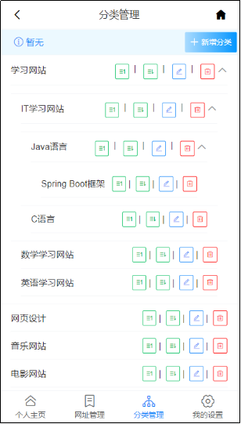

# 在线网址导航
演示地址：http://xt.junengw.com
电脑端没写直接用iframe了所以手机才能QQ登录。

#### 介绍
浏览器保存的书签存在软件、设备限制，一旦更换浏览器软件或者设备后无法保证书签数据实时同步，在线的网址导航系统可以在任何设备任何浏览器随时打开直接使用以前收藏过的网址书签。

#### 软件架构
JDK8、SpringBoot、node14、Vue、MySQL5.7

#### 安装教程

1.  开发工具：IDEA，WebStorm
2.  前后端项目名都是：xunta
2.  后端：拉项目》导包》改配置》运行
3.  前端：拉项目》npm i》运行，后端接口地址：src/api/config.js
4.  有啥文件位置不知道用全局搜索或者顺着流程往下找就行了

#### 几张图片

